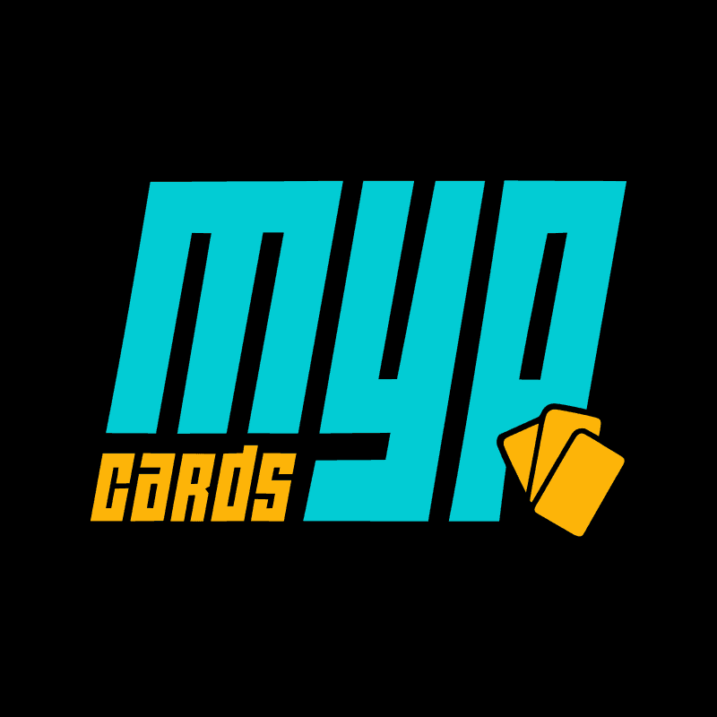

**A plataforma brasileira de trading card games**
cartas avulsas · produtos selados · acessórios

---

MYP Cards é uma plataforma online especializada em trading card games (TCGs) e produtos relacionados, oferecendo uma ampla variedade de cartas avulsas, produtos selados e acessórios para colecionadores e jogadores do Brasil. Trabalhamos com mais de 15 jogos e estamos sempre em expansão.

## 📘 Como Jogar

Não sabe por onde começar? Reunimos guias de **como jogar** os principais card games — com as regras básicas de cada jogo e um **simulador gratuito** para você treinar na hora, direto do navegador.

## 🎴 Jogos e Marcas

Cada jogo tem uma página na loja (🛒) e um guia de como jogar com simulador (📘).

| | Jogo | Sobre | Links |
|:--:|------|-------|-------|
|  | **Yu-Gi-Oh!** | Monstros, magias e armadilhas | [🛒 Loja](https://mypcards.com/yugioh) · [📘 Guia](https://mypcards.com/como-jogar/yugioh) |
|  | **Pokémon** | Nocauteie e conquiste cartas de prêmio | [🛒 Loja](https://mypcards.com/pokemon) · [📘 Guia](https://mypcards.com/como-jogar/pokemon) |
|  | **Magic** | O TCG original, com 30+ anos de história | [🛒 Loja](https://mypcards.com/magic) · [📘 Guia](https://mypcards.com/como-jogar/magic) |
|  | **One Piece** | Lidere tripulações piratas | [🛒 Loja](https://mypcards.com/onepiece) · [📘 Guia](https://mypcards.com/como-jogar/onepiece) |
|  | **Riftbound** | Facções e portais de League of Legends | [🛒 Loja](https://mypcards.com/riftbound) · [📘 Guia](https://mypcards.com/como-jogar/riftbound) |
|  | **Digimon** | Evolua seus monstros digitais | [🛒 Loja](https://mypcards.com/digimon) · [📘 Guia](https://mypcards.com/como-jogar/digimon) |
|  | **Battle Scenes** | Batalhas históricas e estratégia militar | [🛒 Loja](https://mypcards.com/battlescenes) · [📘 Guia](https://mypcards.com/como-jogar/battlescenes) |
|  | **DBS: Fusion World** | Fusões e transformações de Dragon Ball | [🛒 Loja](https://mypcards.com/dbsfusion) · [📘 Guia](https://mypcards.com/como-jogar/dbsfusion) |
|  | **DBS: Masters** | Heróis e vilões de Dragon Ball | [🛒 Loja](https://mypcards.com/dbsmasters) · [📘 Guia](https://mypcards.com/como-jogar/dbsmasters) |
|  | **Flesh & Blood** | Combate tático liderado por heróis | [🛒 Loja](https://mypcards.com/fab) · [📘 Guia](https://mypcards.com/como-jogar/fab) |
|  | **Gundam** | Pilote mobile suits em combate | [🛒 Loja](https://mypcards.com/gundam) · [📘 Guia](https://mypcards.com/como-jogar/gundam) |
|  | **Harry Potter** | Duelos no mundo mágico | [🛒 Loja](https://mypcards.com/hp) · [📘 Guia](https://mypcards.com/como-jogar/hp) |
|  | **Lorcana** | O TCG da Disney | [🛒 Loja](https://mypcards.com/lorcana) · [📘 Guia](https://mypcards.com/como-jogar/lorcana) |
|  | **Lord of the Rings** | Cooperativo na Terra Média | [🛒 Loja](https://mypcards.com/lotr) · [📘 Guia](https://mypcards.com/como-jogar/lotr) |
|  | **Sorcery: Contested Realm** | Fantasia com arte tradicional | [🛒 Loja](https://mypcards.com/sorcery) · [📘 Guia](https://mypcards.com/como-jogar/sorcery) |
|  | **Star Wars: Destiny** | Cartas e dados na galáxia | [🛒 Loja](https://mypcards.com/swdestiny) · [📘 Guia](https://mypcards.com/como-jogar/swdestiny) |
|  | **Star Wars: Unlimited** | Reviva as batalhas da saga | [🛒 Loja](https://mypcards.com/swunlimited) · [📘 Guia](https://mypcards.com/como-jogar/swunlimited) |
|  | **Vanguard** | Unidades e a mecânica de "ride" | [🛒 Loja](https://mypcards.com/vanguard) · [📘 Guia](https://mypcards.com/como-jogar/vanguard) |
|  | **Grand Archive** | Campeões que sobem de nível e deck de materiais | [🛒 Loja](https://mypcards.com/grandarchive) · [📘 Guia](https://mypcards.com/como-jogar/grandarchive) |
|  | **Union Arena**  | Personagens de diferentes universos em um único TCG | [🛒 Loja](https://mypcards.com/unionarena) · [📘 Guia](https://mypcards.com/como-jogar/unionarena)     |
|  | **Weiß Schwarz** | Personagens de animes e jogos em batalhas de cartas | [🛒 Loja](https://mypcards.com/weissschwarz) · [📘 Guia](https://mypcards.com/como-jogar/weissschwarz) |

### 🧩 + Produtos

Acessórios para proteger e organizar sua coleção, além de livros, jogos de tabuleiro, produtos selados para investimento e artigos geek variados — itens que vão além das cartas avulsas.

## 🔌 API

Disponibilizamos uma **API pública** com preços e informações de cartas de todos os jogos, com documentação interativa (Swagger).

- 📖 Documentação: https://mypcards.github.io/mypcards-api/
- 💻 Repositório: https://github.com/MYPCards/mypcards-api
